# 系统烧录 
## 00-物料准备
* MacBook
* 树莓派4B
* TF卡（最好8G以上）
* 系统镜像下载

## 01-格式化内存卡
下载官网的镜像烧录器app，地址：_https://downloads.raspberrypi.org/imager/imager_latest.dmg_

安装后先将内存卡格式化，如下图： 

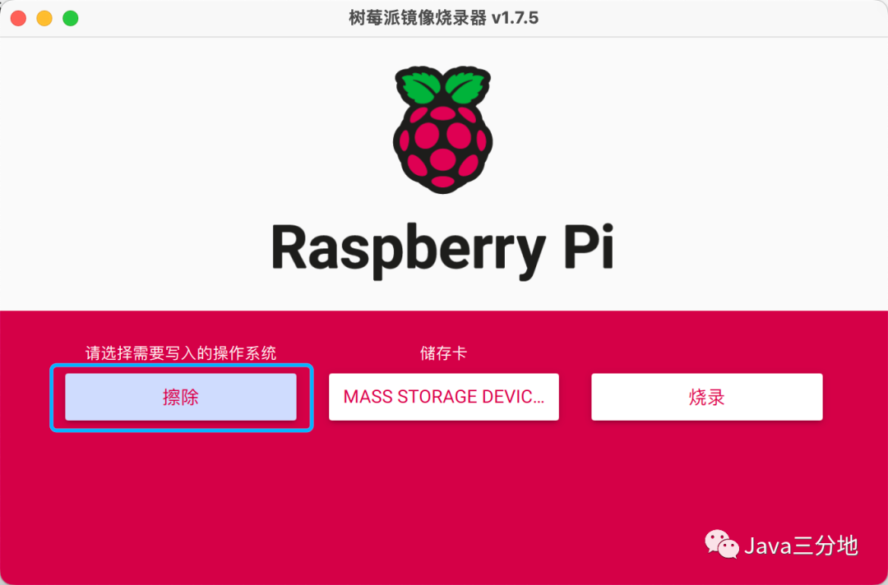

第一个下拉选择“擦除”：
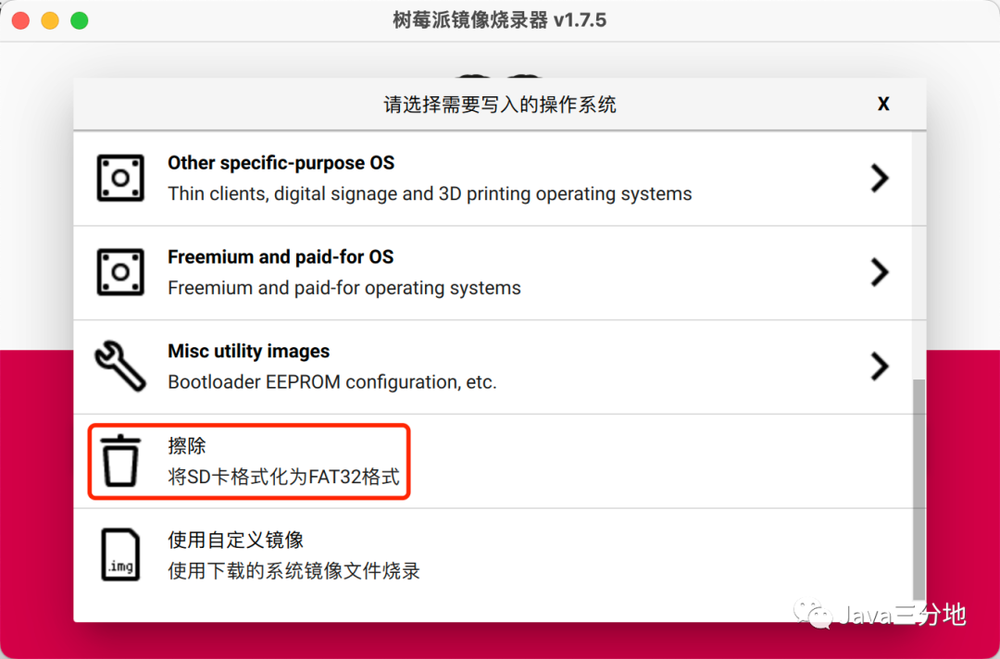

第二个下拉选择内存卡：
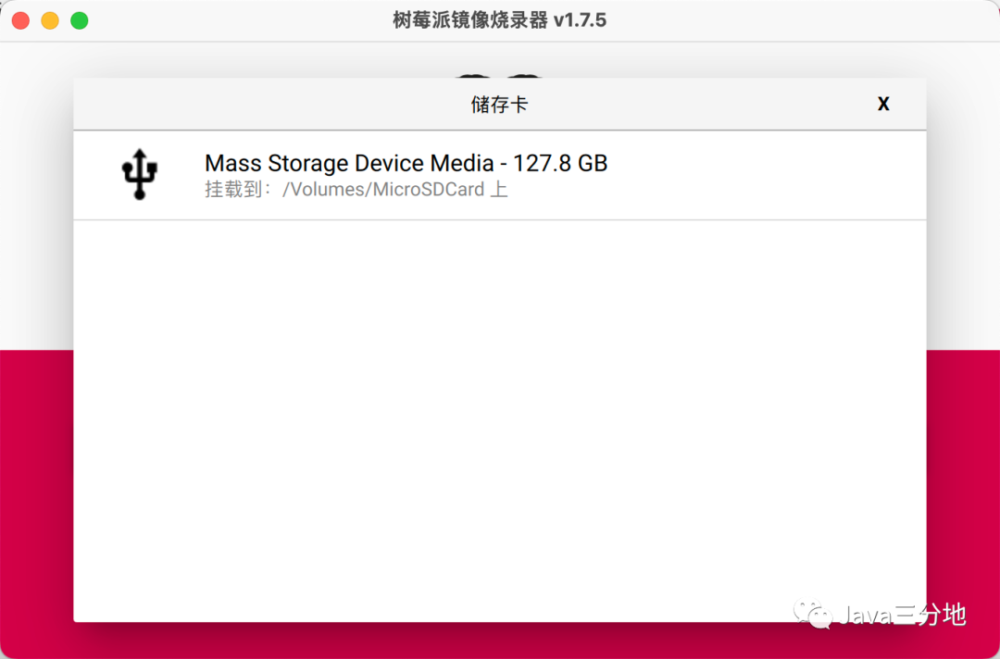

第三个点按“烧录”：
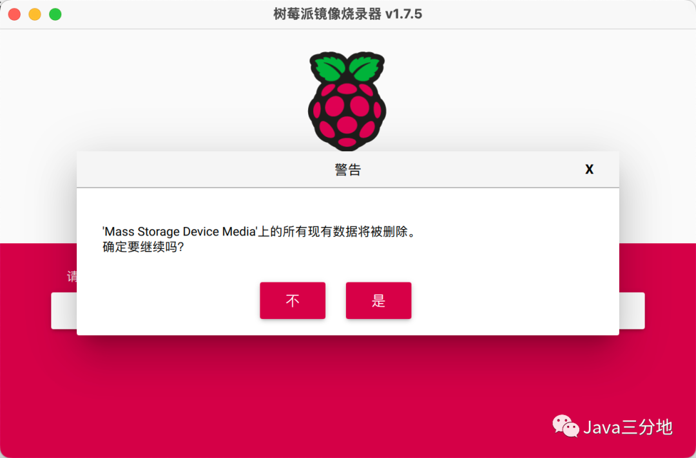

等待擦除结果：
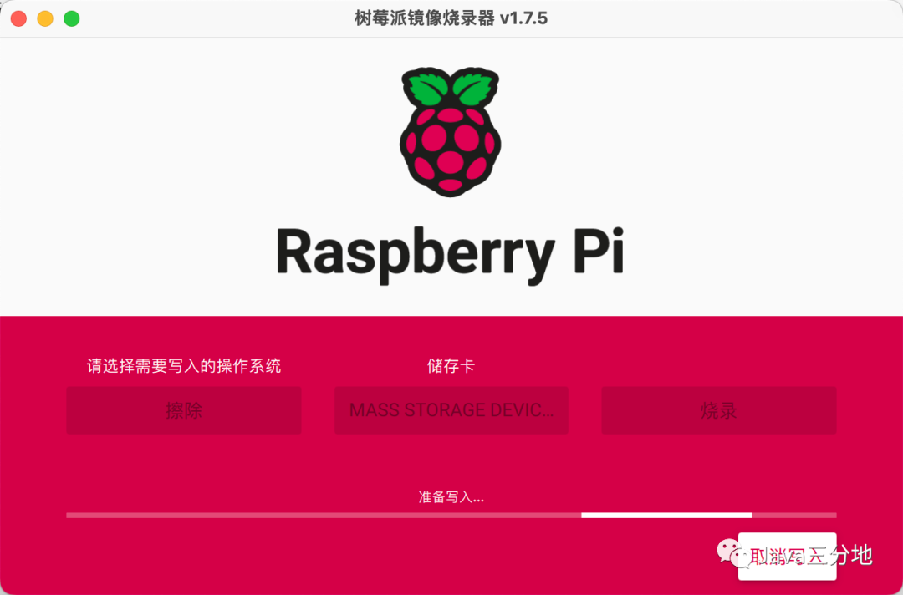

擦除成功（无需取卡）：
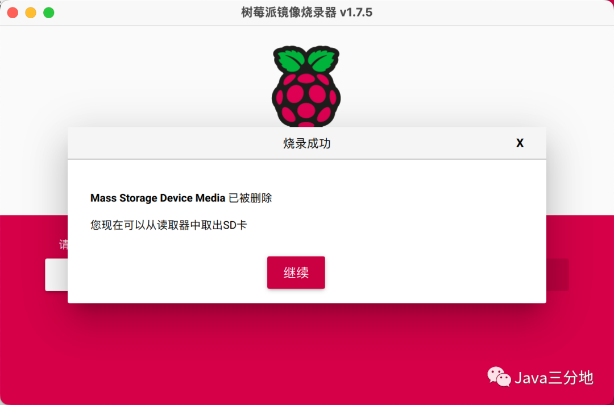

## 02-烧录系统
重复上一步的内容，选择第一个下拉的中要安装的系统，这里我选择树莓派64位桌面版：
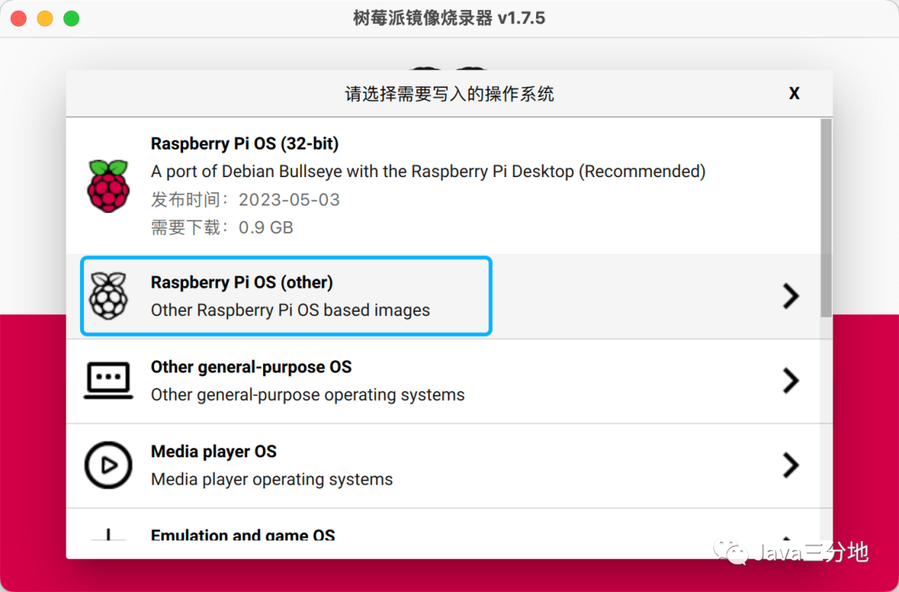

选择系统版本后，可以提前设置（下图右下角）一些基础内容：如wifi配置，开启ssh，创建树莓派用户名等。
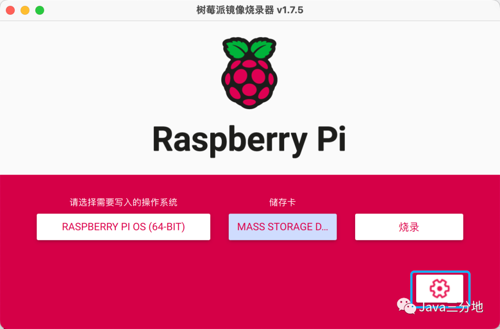
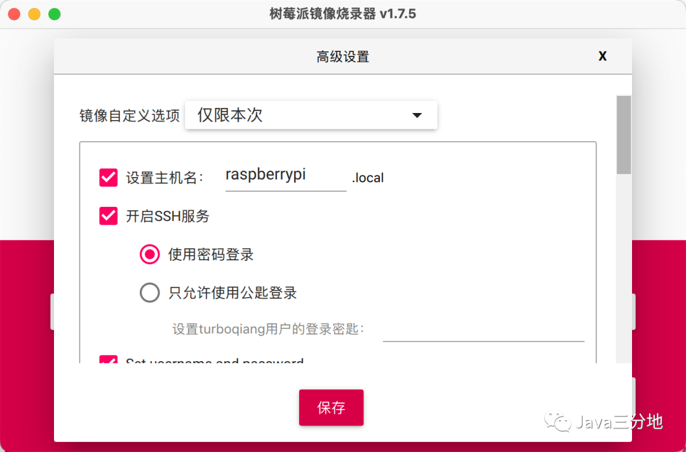
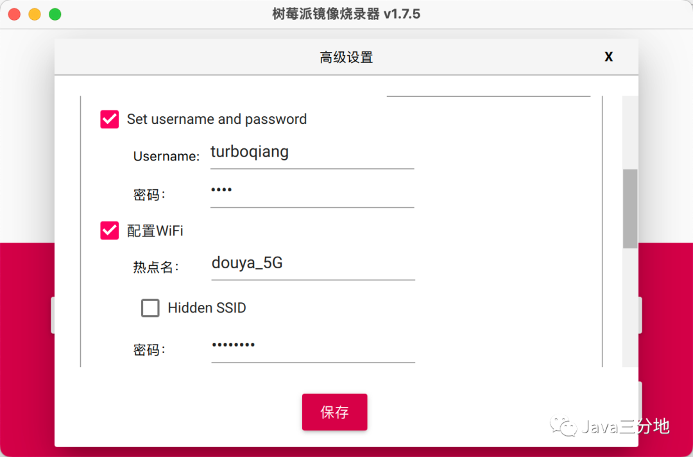
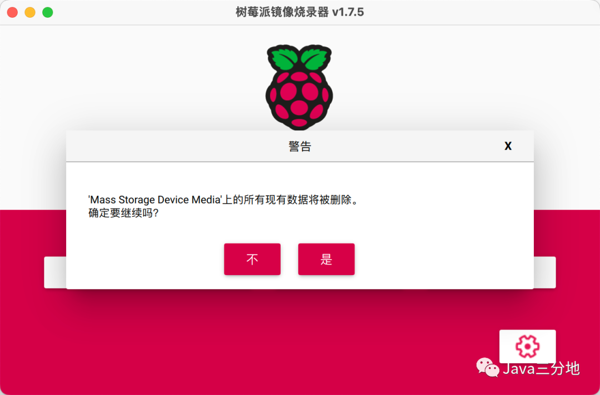

大约十多分钟烧录完毕：
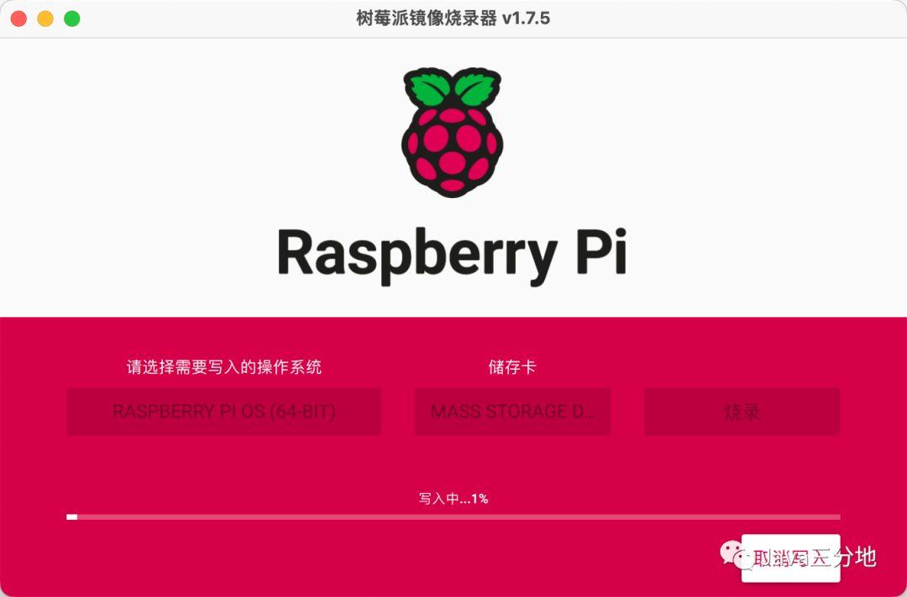

至此，系统烧录的工作就完成了。后续把内存卡插到树莓派开发板背面卡槽通电即可。

## 结语
本文为树莓派入门系列，因兴趣使然，刚刚接触，目前也是学习路上的小白。过程中参考了很多前人的经验，本着程序员的分享与传承的精神，既作为个人的学习记录，也希望为需要的人提供帮助。众人拾柴火焰高，开源精神不死。

## 人生感悟 
_知止而后有定，定而后能静，静而后能安，安而后能虑，虑而后能得。_

文章同步发布于公众号: Java三分地  
关注获取最新文章

