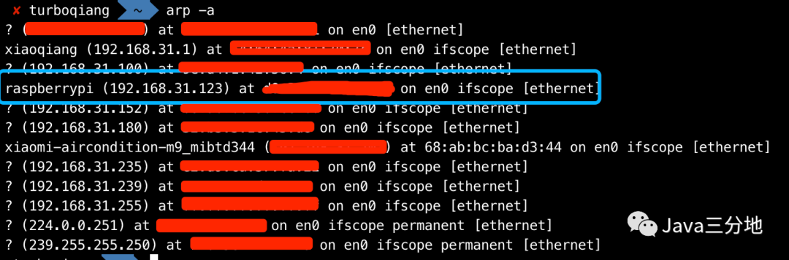
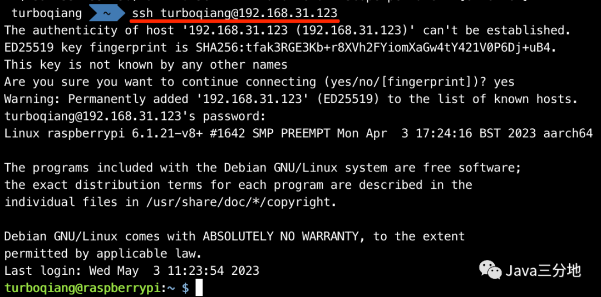

# SSH方式访问树莓派
## 00-树莓派接入局域网
* 确保树莓派开启了SSH（烧录系统时已设置开启）
* **有线**连接树莓派：用网线连接树莓派和路由器，局域网内电脑终端执行以下命令：

> *这里有人可能会问，上一篇中不是设置了树莓派的无线网吗？<br/>
> 可能由于新系统默认未打开wifi（猜测），导致树莓派通电开机后未能自动连接到无线局域网中。未深究，只能退而求其次暂时使用有线方式接入局域网。*

```shell
# 确定树莓派的内网IP 
arp -a
```
打印局域网IP，查看树莓派分配的局域网IP：


## 01-SSH访问树莓派
Mac终端ssh方式访问树莓派，密码使用上篇系统烧录时设置的用户密码。初次链接提示yes or no，yes回车即可，过程中会让输入用户名的密码。

```shell
# （默认端口22，可省略）
ssh turboqiang@192.168.31.123 
```


至此，树莓派已经通过ssh的方式的登录。可以使用简单命令如cd、ls等查看系统的目录结构。

下篇我们将使用`VNC`<sup>®️</sup>`Viewer`访问远程桌面的方式访问树莓派系统。


## 结语
本文为树莓派入门系列，因兴趣使然，刚刚接触，目前也是学习路上的小白。过程中参考了很多前人的经验，本着程序员的分享与传承的精神，既作为个人的学习记录，也希望为需要的人提供帮助。众人拾柴火焰高，开源精神不死。

## 人生感悟
> _沉淀自己最好的方式，就是在繁华中自律，安静处自省，低谷时自强。          ——克罗德·西蒙_
